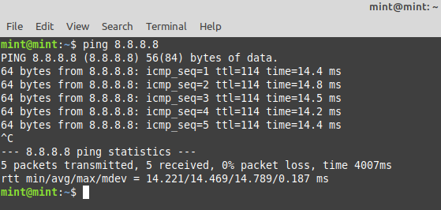

# **Configurer et dépanner le réseau de son poste de travail Linux**


## **Installation de la carte réseau** :
*Les cartes réseau sont souvent détectées au démarrage. Si ce n'est pas le cas il faudra charger les modules correspondants.*  

Dans un premier temps, brancher physiquement la carte réseau.  
<br>
Verifier qu'elle est bien détectée a l'aide de 
```
ifconfig -a
```
ou
```
ip link show
```  
-> *"Eth"* correspond aux liaisons ethernet  
-> *"Lo"* correspond à une carte réseau local  
-> Le reste ne peut être que des cartes réseaux  
<br> 


### Troubleshooting :  

Si la carte réseau n'est pas détectée, il faut charger son module ("driver") avec la commande :  
```
modprobe <nom du module>
```
  

Les modules disponibles pour votre noyau se trouvent dans « /lib/modules/<nom du noyau>/kernel/drivers/net/ ».  

La commande :  
```
ls /lib/modules/`uname -r`/kernel/drivers/net/
```
affiche les modules réseau disponibles pour le noyau en cours d'utilisation   


*Astuces :*

Pour connaître le nom du module en fonction du nom commercial d'une carte, une recherche sur l'internet est souvent la meilleure solution. 

Le noyau donne parfois des informations utiles sur les cartes réseau.  

On peut rechercher les messages contenant "eth0" (ou une quelconque autre interface) pour avoir plus d'informations sur la première carte réseau détectée : 
```
dmesg | grep <votre interface réseau>
```  

La commande suivante permet d'afficher les cartes réseaux reliées au bus PCI :

```
lspci | grep ethernet 
```


## **Configuration de l'interface réseau :**
*Une fois votre carte reconnue par le noyau, vous devez au moins préciser son adresse IP et son masque de sous-réseau. Dans le cas d'un réseau local connecté à l'internet, vous devez aussi ajouter l'adresse IP de la passerelle et l'adresse IP d'un ou plusieurs serveurs DNS.*

Vérifier que l’interface réseau à une adresse ip avec :

```
ip address show
```


Dans le cas ou l'interface ne possède pas d'addresse réseau, utiliser la commande suivante :

```
ip address add <addresse ip>/<masque> dev <votre interface réseau>
```

Dans le cas ou nous avons un doublon d’addresse ip sur une interface, faire :

```
ip address flush dev <votre interface réseau>
```

## **Paserelle et routage :**

Dans un premier temps, consulter la table de routage avec :

```
ip route show
```


Dans le cas ou nous n’aurions aucune passerelle, nous allons en ajouter une avec : 

```
route add default gw <ip de la paserelle> <interface réseau>
```

*Astuce :*
Pour afficher les routes vers les différents réseaux :

```
route -n
```


## **Tester le réseau :**
Pour vérifier que la carte réseau fonctionne, on peut essayer de communiquer avec une autre machine avec la commande

```
ping <adresse ip>
```


La commande ping envoi un paquet à l'adresse IP puis attend que la machine réponde. Elle affiche ensuite le temps qu'a pris toute l'opération, en millisecondes.
  
  

## **information sur les interfaces :**

Pour verifier les ports ouvers, on peut faire :

```
netstat -a
```


## **Configuration automatique au démarrage :**

Le fichier /etc/network/interfaces permet de configurer les cartes réseau de manière permanente.  
Par exemple :

```
auto lo
iface lo inet loopback

auto eth0
iface eth0 inet static
  address 192.168.1.2
  netmask 255.255.255.0
  gateway 192.168.1.1
  dns-nameservers 8.8.8.8
```

Cette configuration initialisera automatiquement les interfaces "lo" et "eth0".  
L'interface "lo" est souvent indispensable au système, il est important de l'initialiser. Elle aura systématiquement l'adresse IP 127.0.0.1. 

L'interface "eth0" sera configurée avec l'adresse IP 192.168.1.2, le masque de sous réseau 255.255.255.0 et la passerelle 192.168.1.1 (ce paramètre est facultatif).  

Dans le cas d'une IP fixe, il vaut mieux renseigner un serveur DNS (ci-dessus celui de Google).  

Sinon, si l'interface eth0 doit être configurée automatiquement par un serveur DHCP, il faut indiquer :

```
auto eth0
iface eth0 inet dhcp
```

Pour que les modifications de ce fichier soient prises en compte, il faut redémarrer ou utiliser les commandes ifup et ifdown.  
Par exemple :

```
ifup eth0
```

ATTENTION : Avant de redémarrer la configuration réseau (systemctl restart networking, ou ifup/ifdown, ...) déconfigurez manuellement les interfaces réseaux via la commande :

```
ip addr flush ethX 
```

(X valant 0 puis 1 puis 2 pour r2).

## **Résolution de noms d'hôte :**
Le fichier /etc/host.conf indique comment les noms doivent être résolus (c'est à dire comment passer d'une adresse IP à un nom, et inversement). Par exemple :

```
# D'abord traduire avec les serveurs DNS et ensuite avec /etc/hosts.
order bind,hosts

# Il existe des machines avec plusieurs adresses
multi on

# Vérifie l'usurpation d'adresse IP
nospoof on
```

## **Serveurs DNS :**

Le fichier /etc/resolv.conf contient les adresses IP des serveurs DNS.  
Par exemple :

```
nameserver 208.164.186.1
nameserver 208.164.186.2
search foo
```

La commande search indique que si un nom de domaine n'est pas trouvé, il faudra essayer en lui ajoutant .foo.
Le DNS le plus simple a utiliser et retenir est 8.8.8.8 qui correspond a celui de Gooogle

## **Fichier hosts :**
Le fichier /etc/hosts contient une liste de résolutions de noms (adresses IP et noms de machine).  
Par exemple:

```
192.168.105.2 toto
```

Ce fichier indique que *toto* correspond à l'adresse IP *192.168.105.2*, qui sera accessible par cet alias.  


## **Problèmes connus :**
Ping: unknow host  
1. Vérifier en renseignant le DNS mentionné ci-dessus.
2. Tester le pare-feu : 

```
telnet 8.8.8.8 53
```

3. Si

```
dig google.fr
```

fonctionne mais pas 

```
dig @8.8.8.8 google.com
```

vérifier que le sous-réseau de la machine a bien accès au DNS.
  


# **Administration sous Windows :**

Configuration TCP/IP
Pour utiliser les protocoles de la pile TCP/IP, l'administrateur réseau doit attribuer à l'interface une adresse IP unique (non redondante) sur le réseau logique auquel elle appartient.  
C'est l'adressage STATIQUE.  
Un nombre de 4 octets choisi dans un plan d'adressage prédéfini.  
Il fournira aussi un masque de sous réseau qui permettra à l'interface de connaître le sous réseau auquel elle appartient.  
L'adresse de diffusion (broadcast) sera la dernière @IP de la plage du sous réseau.

Pour que cette machine puisse émettre des datagrammes vers d'autres réseaux (logique et/ou physique), l'administrateur devra lui fournir une adresse de passerelle par défaut ou default gateway (une porte de sortie, un routeur connecté au même segment de réseau physique et adressé dans le même réseau logique que la machine qui prendra en charge les datagrammes afin de les envoyer à leur destination).

Pour l'accès à Internet par résolution de nom, l'adresse IP d'un serveur DNS devra aussi être fournie. (Plusieurs adresses peuvent être fournies)

Dans des cas particuliers, on pourra fournir à l'interface plusieurs adresses IP (sur le même réseau logique ou pas).

## **Adressage dynamique par DHCP :**
Pour éviter de paramétrer l'interface manuellement, l'adressage dynamique peut aussi être choisi à condition qu'il existe sur le segment de réseau physique au moins un serveur DHCP (Dynamic Host Configuration Protocol) pour répondre à la demande de la machine.

Dans le cas contraire, c'est par l'intermédiaire d'APIPA (Automatic Private IP Addressing) qu'une adresse IP entre 169.254.0.1 et 169.254.255.254 avec un masque de sous-réseau de 255.255.0.0 sera automatiquement assignée si aucune configuration alternative n'a été spécifiée.  
APIPA est conçu pour fournir un adressage IP automatique sur des réseaux à segment unique exclusivement.

## **Paramétrage des interfaces réseaux :**
Le paramétrage sous Windows s'effectue par l'intermédiaire d'une interface graphique dont les modifications seront enregistrées dans la base de registre. Il faut des droits d'administrateur local à la machine pour modifier ces paramètres. Cette interface se trouve dans Menu démarrer > Paramètres > Panneau de configuration > Connexions réseau > Interface à modifier

On peut choisir de montrer l'état des interfaces dans la barre de lancement rapide.  
Les interfaces réseau peuvent être nommées pour en faciliter le repérage.

## **Test des interfaces :**

Ouvrir une console en ligne de commande par Menu démarrer > Exécuter > « cmd »

## ipconfig : 
Visualisation des paramètres de toutes les interfaces réseau :

```
ipconfig /all
```


## ping :


Test de l'interface de bouclage :

```
ping 127.0.0.1
```

Test de la passerelle :

```
ping <@ip_passerelle>
```

Test de la connectivité Internet :

```
ping <@ip_externe>
```

## Route :

Visualisation de la table de routage :

```
route print
```


Ajout d'une route :

```
route add <votre_route>
```


Supression d'une route :

```
route delete <votre_route>
```


## Tracert :

Test de routage :

```
tracert <@ip_externe>
```


Tracert utilise une augmentation progressive du TTL (time-to-leave) et se sert des messages d'erreur ICMP émis par les routeurs lorsqu'il est détruit par arrivé a expiration du TTL.

## Netstat :  

Visualisation des services actifs :

```
netstat /a
```


## Nslookup :

Test de la résolution DNS :

```
nslookup <nom_a_résoudre>
```


